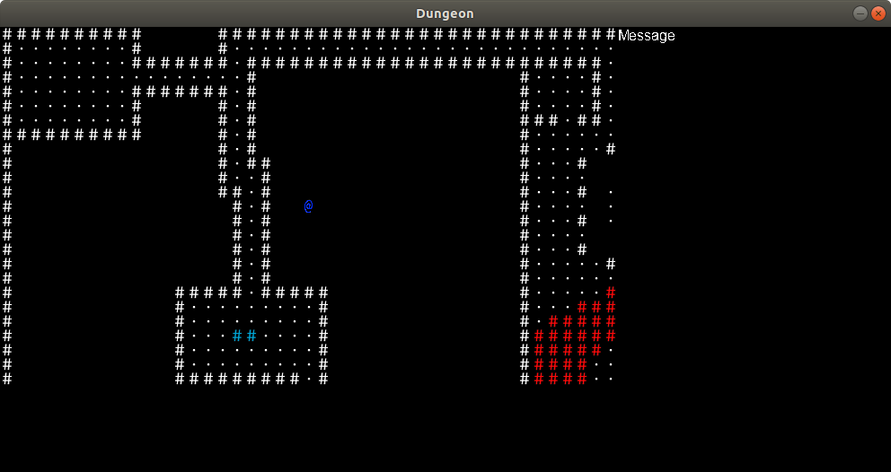

# Dungeon
A top down 2D tile-based roguelike game written in C and python using SDL2 and pygame respectively.
The purpose is mainly to improve my own coding skills and teach myself more about a lot of cool algorithms while making something fun in the process.

The project is thus far split in two. The python part is a random dungeon generator. It is mainly an exploration of different ways of randomly generating the basic layout of a classic dungeon(rooms and corridors). It is not intended to be playable, although it sort of is. Python is fast when you just want to test an algorithm. After testing things in python, the valuable insights gained can then be incorporated into the - hopefully - more "proper" C-version which is more of a game than a mashup of algorithms. 

## Current work and problems
This is a general list of the things that I'm currently working on, should you have any tips or wanted to contribute.
* An easy way to display/handle how in-game messages. This is important as most things will be conveyed via messages. My initial thought was to have a message module which could handle all messages displayed(up to a max number), this way, displaying them could be done by querying the module for the last 5 messages and display them. One thing I cannot decide is if the module should handle its own drawing, or if it only stores the messages like the map does. I'm leaning towards the latter.
* General clean-up. The code base, though relatively tidy so far is becoming messy, which I don't like. If this project is to handle scaling, it needs to be tidy. So, the main loop should perhaps have its own header file as the number of functions grow.
## Next up
When all the above are fixed, what then?
* Start looking at a module which will generate the actuall dungeons and handle them. It will move monsters, players, handle items, etc. Or, should it be wider than that even? Should it perhaps be the main engine itself which will handle AI, movement, VOF(Field of View), generating levels, npcs, time-management etc? I don't know. 
* Start looking at actual mechanics and physics.

# Getting Started
Copy the project folder or clone it.

### Prerequisites
So far, it only runs/compiles in linux. A future version might feature Windows support, but it's not high on my priority-list.

#### dungeon generator in python
python3.6
pygame for linux and python3

Run with:
python3 dungeon.py <width in pixels> <height in pixels> <recursive depth>
Example:
```python3 dungeon.py 1300 700 4```
### Screenshot using above example

To play/test:
"L" resets all lists and spawns a new level
Keypad numbers 1-9 moves the blue "@" around

Upon reaching the green arrow going down, a new level is spawned.


#### basic game engine in C
SDL2 SDL_image and SDL_ttf libraries. All are to be found in standard linux repo.

Compile with:
make
Run with:
./dungeon <optional width> <optional height>
or
make run
Example:
```./dungeon 1000 500```
### Screenshot using above example

To play/test:
Keypads or arrows to move around
Level is a hardcoded for display-testing purposes. No mechanics implemented. But a hardcoded alpha in the middle of the map-view. 

## Built With
* [SDL2](https://www.libsdl.org/download-2.0.php) - Simple Direct Media Layer
* [pygame](http://www.pygame.org) - For quic and easy graphics
* [python3](https://www.python.org/download/releases/3.0/) - For quick and easy code
* [C](https://en.wikipedia.org/wiki/C_(programming_language)) - For more learning and control

## Authors
* **Raymon Skjørten Hansen** - *Initial work* - [Raymon on Github](https://github.com/raymonshansen)

## Contributors
* **Isak Sunde Singh** - *Tips and help* - [Isak in Github](https://github.com/IsakSundeSingh)
* **Mads Johansen** - *Tips and help* - [Mads on Github](https://github.com/MaxJohansen)

## Acknowledgments
* Thomas Biskups [Ancient Domains of Mystery](wwww.adom.de)
* Jamis Bucks Growing Tree Algorithm [Jamis Bucks Blog](http://weblog.jamisbuck.org/2011/1/27/maze-generation-growing-tree-algorithm)
* 